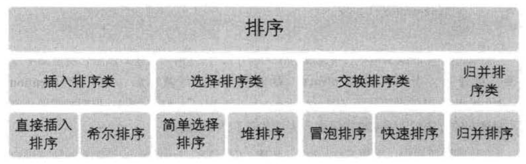
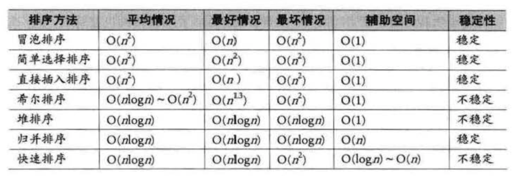
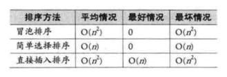

# YSAlgorithms

>常用一些算法汇总，性能测试等

## Contents
*   排序算法
       * 冒泡
       * 选择
       * 插入
       * 折半插入（二分法）
       * 希尔
       * 堆
       * 快速
       * 归并

## Summary
>根据将排序记录是否全部放置在内存中，将排序分为内排序和外排序，之前讲的都是内排序，这里总结一下，内排序分为四类：插入排序、交换排序、选择排序和归并排序。

 

目前还没有十全十美的排序算法，即使是快速排序法，也只是在整体性能上优越，它也存在排序不稳定、需要大量辅助空间、对少量数据排序无优势等不足。这里我们就来从多个角度来剖析一下提到的各种排序的长与短。
我们将7种算法的各种指标进行对比：

从算法的简单性来看，分为两类： 
* 简单算法：冒泡、选择、插入。 
* 改进算法：希尔、堆、归并、快速。

### 平均情况
显然最后3种改进算法要胜过希尔排序，并远远胜超过前3种简单算法，所以堆、归并、快速算法要好一点。
### 最好情况
冒泡和插入排序要更胜一筹，如果你的待排序序列总是基本有序，你就考虑这两种算法。
### 最坏情况
堆排序和归并排序又强于快速排序以及其他简单排序。
空间复杂度：归并排序和快速排序就比较消耗内存。所以不要选择归并排序和快速排序。
### 稳定性
归并排序独占鳌头。
###待排序记录的个数
待排序的个数n越少，采用简单排序方法越合适，反之，n越大，采用改进排序方法越合适。至于n多少比较合适，目前还没有定义。

从表中看，似乎选择排序在3种简单排序中性能最差，其实也不完全是，比如，如果比较的关键字信息量比大，比较次数比较多，这样移动记录所花费的时间也就越多，我们给出3种简单排序算法的移动次数比较：

你会发现选择排序就非常有优势，原因在于它是通过大量比较后选择明确记录进行移动，有的放矢。因此对于数量不是很大而比较需求比较大的时候，选择排序算法是占优的。另外，记录的关键信息量大小对那四个改进算法影响不大。

### ` 总之，从指标来看，快速排序是性能最好的排序算法，如果求稳定的话，建议选择归并排序。`

## Author

yuansirios, yuansir_ios@163.com

## License

YSAlgorithms is available under the MIT license. See the LICENSE file for more info.
